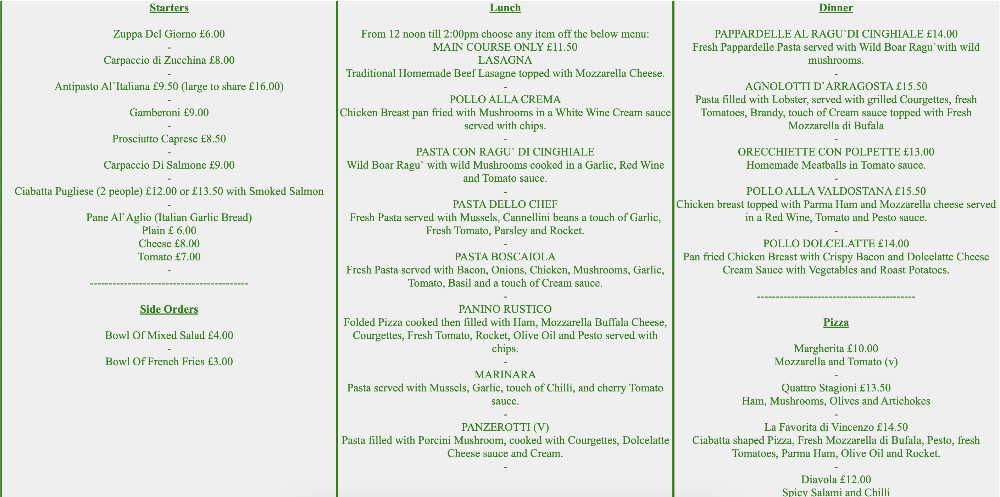
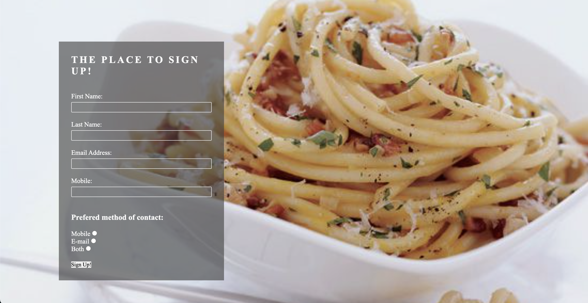

# Italian_Restaurant_Project

La Trattoria da Vincenzo is a small and traditional run restaurant, providing traditional and family cooked recipes. The site will be targeted towards families that enjoy traditional meals and something different to larger chain restaurant. Italian_Restaurant_Project will be useful for families looking for authentic Italian recipes.

![Responsive Mockup] -Enter responsive mockup preview.

### Existing Features

- __Navigation Bar__

  - Featured on all four pages, the full responsive navigation bar includes links to the Logo, Home, Menu, Gallery and Sign Up pages and is exactly the same on each page to allow for simple and effective navigation.
  - This section will allow the users to travel from each page easily including using the back button. 

- __Restaurant Section__

  - The Restaurant section explains to the user what type of restaurant it is and explains the history of the owner and chef.
  - The user will be able to see how long the restaurant has been around and what the history is for delivering high quality meals over a period of time.

- __Menu__

  - The menu tells the user what foods are available and what available selections there are.
  - The user will be able to see pricings for foods and the variety of food available to them.

- __Gallery__

  - The gallery will provide users with meals previously prepared by the chef. 
  - This section is useful to the user to show what standard of food the restaurant has and the variety of food available.

- __Sign Up__

  - This page will allow the user to get signed up to La Trattoria da Vincenzo to hear about promotions and offers. The user will be able specify if they want to hear by email, text or even both. The user will be asked to submit their first name, last name, email address and mobile number.

 

- __The Footer__ 

  - The footer section includes links to the relevant Contact information for La Trattoria da Vincenzo. 
  - The footer section includes opening times and days.
  - The footer is valuable to the user as it displays how the restaurant can be contacted and when.
  - The footer also gives information on where the restaurant is located including a clickable icon that opens google maps for convenience.

## Testing 

### Validator Testing 

- HTML
  - No errors were returned when passing through the official after 3 modifications were made. [W3C validator]
- CSS
  - No errors were found when passing through the official [(Jigsaw) validator]

  

### Unfixed Bugs

No unfixed bugs left.

## Deployment

This section should describe the process you went through to deploy the project to a hosting platform (e.g. GitHub) 

  - The site was deployed to GitHub pages. The steps to deploy are as follows: 
  - In the GitHub repository, navigate to the Settings tab.
  - From the source section drop-down menu, select the Master Branch.
  - Once the master branch has been selected, the page will be automatically refreshed with a detailed ribbon display to indicate the successful deployment. 

The live link for my site is as follows: ADD LINK HERE!!!!!! <————

## Credits 

### Content 

- The text for the Home page was taken from (https://www.la-trattoria.co.uk/).
- Instructions on how to implement form validation on the Sign Up page was taken from code institute love running project.
- The icons in the footer were taken from [Font Awesome](https://fontawesome.com/).
- The layout for the Footer/Menu was taken from (https://www.w3schools.com/howto/howto_css_three_columns.asp).

### Media

- The photo used on the home page was taken from (https://www.la-trattoria.co.uk/my-italian-history/).
- The images used for the gallery page were taken from pexels.

